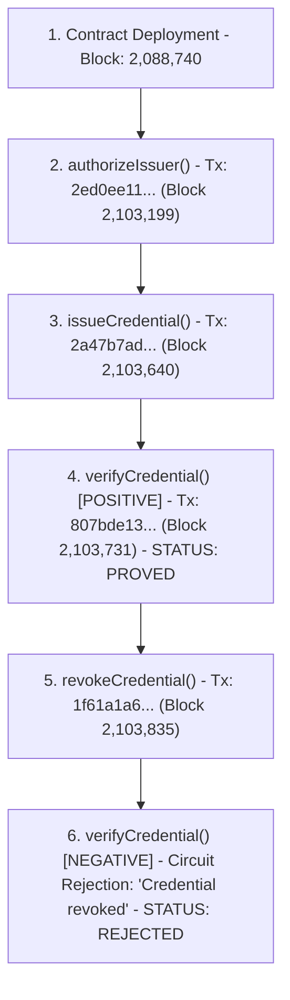

# VeilCred

[](https://github.com/subhadip7699/VeilCred/actions/workflows/ci.yml)
[](./tests/)
[](https://docs.midnight.network/)
[](https://indexer.preprod.midnight.network/api/v4/graphql)
[](https://opensource.org/licenses/MIT)

> **Privacy-preserving zero-knowledge credential issuance, verification, and revocation platform built on Midnight Network.**


## 1. Overview & Problem Statement

Modern credential systems (KYC, accreditation, membership tiers, employee badges) suffer from a fundamental privacy flaw: **over-disclosure**. To prove compliance or qualification, users must present raw identity documents, exposing full names, dates of birth, exact tiers, and issuing authority signatures. Furthermore, existing on-chain identity systems make credential presentation trackable across dApps, creating persistent linkability.

### The VeilCred Solution
**VeilCred** implements a complete zero-knowledge credential lifecycle leveraging Midnight's Compact smart contract language and zero-knowledge ledger:
- **Private Witness Model:** Holder secrets and credential attributes remain strictly local to the browser/wallet.
- **Zero-Knowledge Thresholds:** Prove `tier >= requiredTier` without disclosing the exact tier.
- **Selective Disclosure:** An observer verifies that a credential was issued by an authorized issuer and has not been revoked, without learning the user's identity or secret.
- **On-Chain Revocation:** Issuers retain authority to revoke credentials without invalidating the zero-knowledge privacy guarantees for remaining holders.

---

## 2. Canonical Deployed Smart Contract (Midnight Preprod)

The VeilCred smart contract is deployed and verified on the official **Midnight Preprod Testnet**:

| Parameter | Value |
| :--- | :--- |
| **Contract Address** | `` |
| **Deployment Transaction** | `` |
| **Deployment Block** | `` |
| **Network ID** | `preprod` |
| **Language & Toolchain** | Compact `v0.31.1` (`pragma language_version >= 0.23.0`) |
| **Indexer Endpoint** | `https://indexer.preprod.midnight.network/api/v4/graphql` |
| **Proof Server (Prover)** | `https://api-preprod.1am.xyz` (ProofStation by 1AM) |

### Query Contract State via GraphQL
```graphql
# POST https://indexer.preprod.midnight.network/api/v4/graphql
query {
  contractAction(address: "dcef898920d314ca3ad8c512ec356befac3407c730700b0323cd9577faadd18f") {
    state
  }
}
```

---

## 3. Verified End-to-End On-Chain Protocol Lifecycle

The full 6-stage lifecycle has been executed and confirmed on Midnight Preprod:




### Data Visibility Matrix

| Data Item | Stored On-Chain? | Publicly Visible? | Role in Proving |
| :--- | :---: | :---: | :--- |
| `issuerSecret` | ❌ No | ❌ Private | Private witness in `authorizeIssuer`, `issueCredential`, `revokeCredential` |
| `userSecret` | ❌ No | ❌ Private | Private witness in `verifyCredential` |
| `userId` | ❌ No | ❌ Private | Derived within ZK circuit |
| `credentialType` (Tier) | ❌ No | ❌ Private | Private witness evaluated against public `requiredType` |
| `credentialCommitment` | ✅ Yes | ✅ Public (Disclosed) | Stored in `issued` and `revoked` ledger maps |
| `issuerId` | ✅ Yes | ✅ Public (Disclosed) | Stored in `issuers` ledger map |
| `requiredType` | ❌ Ephemeral | ✅ Public | Public argument passed to `verifyCredential` circuit |

### Demonstration Issuer Architecture Disclosure
In this live Preprod MVP, the "Issuer (Demo)" interface is provided strictly as a demonstration and testing harness to allow evaluators and community testers to experience the complete issuance and revocation lifecycle on Midnight Preprod. It does **not** represent production issuer key management infrastructure. In production deployments, issuing authorities manage private keys within secure hardware security modules (HSMs) or enterprise key vaults and publish commitments via administrative endpoints. The underlying smart contract (`Vault.compact`) cryptographically enforces that only authorized issuer commitments registered in the `issuers` ledger map can mint or revoke credentials.

---

## 5. Smart Contract Source (`contracts/Vault.compact`)

```compact
pragma language_version >= 0.23.0;

import CompactStandardLibrary;

export ledger issuers: Map<Bytes<32>, Boolean>;
export ledger issued: Map<Bytes<32>, Bytes<32>>;
export ledger revoked: Map<Bytes<32>, Boolean>;
export ledger verificationCount: Counter;

witness issuerSecret(): Bytes<32>;
witness credentialSecret(): Bytes<32>;
witness credentialIssuer(): Bytes<32>;
witness credentialType(): Uint<8>;

export circuit authorizeIssuer(issuerId: Bytes<32>): [] {
  const secret = issuerSecret();
  const vault_issuer_domain: Bytes<32> = pad(32, "vault:issuer");
  const derivedIssuerId = persistentHash<Vector<2, Bytes<32>>>([secret, vault_issuer_domain]);
  
  assert(derivedIssuerId == issuerId, "Issuer secret mismatch");
  issuers.insert(disclose(issuerId), disclose(true));
}

export circuit issueCredential(credentialCommitment: Bytes<32>): [] {
  const secret = issuerSecret();
  const vault_issuer_domain: Bytes<32> = pad(32, "vault:issuer");
  const issuerId = persistentHash<Vector<2, Bytes<32>>>([secret, vault_issuer_domain]);
  
  const publicIssuerId = disclose(issuerId);
  assert(issuers.lookup(publicIssuerId) == true, "Issuer not active");
  
  issued.insert(disclose(credentialCommitment), publicIssuerId);
}

export circuit verifyCredential(requiredType: Uint<8>): [] {
  const secret = credentialSecret();
  const ctype = credentialType();
  const issuerId = credentialIssuer();

  const vault_user_domain: Bytes<32> = pad(32, "vault:user");
  const userId = persistentHash<Vector<2, Bytes<32>>>([secret, vault_user_domain]);
  
  const ctypeBytes = ctype as Field as Bytes<32>;
  const commitment = persistentHash<Vector<3, Bytes<32>>>([userId, ctypeBytes, issuerId]);
  
  const publicCommitment = disclose(commitment);
  const publicIssuerId = disclose(issuerId);
  
  assert(issued.member(publicCommitment) == true, "Credential not issued");
  assert(issued.lookup(publicCommitment) == issuerId, "Issuer mismatch");
  assert(issuers.lookup(publicIssuerId) == true, "Issuer deactivated");
  assert(revoked.member(publicCommitment) == false, "Credential revoked");
  assert(ctype >= requiredType, "Insufficient tier");
  
  verificationCount.increment(1);
}

export circuit revokeCredential(credentialCommitment: Bytes<32>): [] {
  const secret = issuerSecret();
  const vault_issuer_domain: Bytes<32> = pad(32, "vault:issuer");
  const callerId = persistentHash<Vector<2, Bytes<32>>>([secret, vault_issuer_domain]);
  
  const publicCallerId = disclose(callerId);
  const publicCommitment = disclose(credentialCommitment);
  
  assert(issuers.lookup(publicCallerId) == true, "Caller not authorized");
  assert(issued.member(publicCommitment) == true, "Credential does not exist");
  assert(issued.lookup(publicCommitment) == publicCallerId, "Not issuer of credential");
  assert(revoked.member(publicCommitment) == false, "Already revoked");
  
  revoked.insert(publicCommitment, disclose(true));
}
```

---

## 6. Technology Stack

- **Smart Contracts:** Compact `0.31.1` (`compactc`)
- **ZK & Cryptographic Runtime:** `@midnight-ntwrk/compact-runtime` `^0.16.0`, `@midnight-ntwrk/compact-js` `2.5.1`
- **SDK & DApp Connector:** `@midnight-ntwrk/dapp-connector-api` `4.0.1`, `@midnight-ntwrk/midnight-js-contracts` `4.1.1`
- **Frontend Framework:** React 18, Vite 5, Tailwind CSS, Lucide React, Framer Motion
- **Prover Infrastructure:** ProofStation by 1AM (`https://api-preprod.1am.xyz`) & Official Midnight Proof Server fallback
- **Wallets Supported:** 1AM Wallet (recommended, native proof support), Lace Wallet

---

## 7. Installation & Local Setup

### Prerequisites
- **Node.js**: `v20.x` or `v22.x`
- **npm**: `v10+`
- **Browser Wallet**: 1AM Wallet extension (or Lace Beta extension) configured for **Midnight Preprod**.

### Step 1: Clone Repository
```bash
git clone https://github.com/subhadip7699/VeilCred.git
cd VeilCred
```

### Step 2: Install Dependencies
```bash
# Install root dependencies
npm install

# Install frontend dependencies
cd frontend
npm install
cd ..
```

### Step 3: Configure Environment Variables
Create or verify `frontend/.env`:
```env
VITE_NETWORK_ID=preprod
VITE_CONTRACT_ADDRESS=
VITE_INDEXER_URI=https://indexer.preprod.midnight.network/api/v4/graphql
VITE_INDEXER_WS_URI=wss://indexer.preprod.midnight.network/api/v4/graphql/ws
VITE_PROOF_SERVER_URI=https://proof-server.preprod.midnight.network
```

### Step 4: Run Tests
```bash
npm test
```

### Step 5: Start Development Server
```bash
cd frontend
npm run dev
```
Open `http://localhost:3000` in your browser.

---

## 8. Wallet Onboarding & DUST Gas Setup

Midnight transactions require **DUST** tokens to pay for zero-knowledge verification gas.

1. **Request Testnet $tNIGHT**:
   - Request `$tNIGHT` tokens from the [Midnight Preprod Faucet](https://faucet.preprod.midnight.network/).
2. **Generate DUST**:
   - In 1AM Wallet or Lace, navigate to **DUST Management**.
   - Select **Generate DUST** using your unshielded `$tNIGHT` balance.
3. **Wait for DUST Maturity**:
   - Newly generated DUST undergoes a brief maturation window before becoming available for signing transactions.
4. **Interact**:
   - Connect your wallet on VeilCred and execute zero-knowledge proofs seamlessly.

---

## 9. CI/CD Pipeline

The GitHub Actions workflow (`.github/workflows/ci.yml`) automatically executes on every push and pull request to `main`:
1. **Compact Contract Compilation**: Installs the genuine Compact `0.31.1` compiler on Ubuntu, compiles `contracts/Vault.compact`, verifies all generated artifacts (PK, VK, binary ZKIR), and asserts anti-regression rules.
2. **Automated Testing**: Runs unit test suites validating credential protocol invariants.
3. **Frontend Production Build**: Installs frontend packages and verifies clean `vite build` compilation with zero TypeScript errors.

---

## 10. Product X (Twitter) & Demo Video

### Product X Profile
- **Handle:** [@VeilCred_](https://x.com/VeilCred_)
- **Profile Name:** VeilCred
- **Bio:** Zero-Knowledge Credential Infrastructure on @MidnightNtwrk. Privacy-preserving issuance, threshold verification & revocation.
- **Link:** [https://x.com/VeilCred_](https://x.com/VeilCred_)

### MVP Demo Video
- **Watch Demo:** [Watch the VeilCred MVP Demo](https://drive.google.com/file/d/1zPzHtmwoX7Y_Ul8eqLfmV5v_1o_4YMRQ/view?usp=drive_link)

### Demo Video Script (2-4 Minutes)
1. **0:00 - 0:30**: Introduction, problem of over-disclosure in Web3 ID, Midnight privacy model.
2. **0:30 - 1:00**: Wallet connection on Preprod & canonical contract overview (`dcef8989...`).
3. **1:00 - 1:45**: Issuer flow — Authorizing an issuer and issuing a Tier 1 credential commitment.
4. **1:45 - 2:30**: Holder flow — Generating local ZK proof and verifying `Tier >= 1` on-chain without revealing identity.
5. **2:30 - 3:15**: Revocation flow — Issuer revokes the credential; proving the negative path where verification is rejected.
6. **3:15 - 3:45**: Preprod Explorer & GraphQL Indexer proof inspection.

---

## 11. Security & Privacy Considerations

- **Private State Confidentiality**: Secrets (`issuerSecret`, `userSecret`, `credentialType`) are held exclusively in browser memory and passed via private witness functions during local WASM proving.
- **Linkability**: In this baseline implementation, public commitments are published to the ledger. Future iterations can introduce nullifier sets for unlinkable multi-presentation.
- **Circuit-Level Validation**: All invariants (authorization, active status, threshold eligibility, revocation) are cryptographically enforced inside ZK circuits.

---


## 12. D4 Final Submission Checklist

| Item | Status | Link / Details |
| :--- | :---: | :--- |
| **Public GitHub Repository** | ✅ PASS |  |
| **Full Technical Documentation** | ✅ PASS | [README.md](./README.md) with ZK mathematics & architecture |
| **Live Preprod Demo** | ✅ PASS | |
| **Canonical Preprod Contract** | ✅ PASS | `dcef898920d314ca3ad8c512ec356befac3407c730700b0323cd9577faadd18f` |
| **CI/CD Workflow** | ✅ PASS | [.github/workflows/ci.yml](./.github/workflows/ci.yml) |
| **Passing CI & Build Status** | ✅ PASS | Tests: 4/4 passed, Vite: 0 errors |
| **15+ Meaningful Commits** | ✅ PASS | 87+ meaningful commits on `main` |
| **Product X Profile** | ✅ PASS | [@VeilCred_](https://x.com/VeilCred_) |
| **Demo Video** | ✅ PASS | [Watch MVP Demo](https://drive.google.com/file/d/1zPzHtmwoX7Y_Ul8eqLfmV5v_1o_4YMRQ/view?usp=drive_link) |

---


## 14. License


This project is licensed under the **MIT License** — see the [LICENSE](./LICENSE) file for details.
